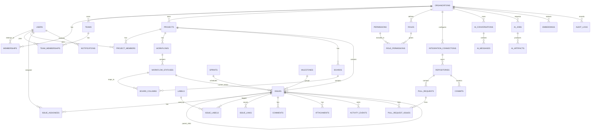

# DevTrack AI PostgreSQL Database Design

This schema is designed for a production multi-tenant SaaS application with normalized transactional data, strong tenant isolation, auditability, soft deletion, and room for AI/integration workloads.

## ER Diagram



## Table Groups

- Identity and tenanting: `organizations`, `users`, `memberships`, `roles`, `permissions`, `role_permissions`.
- Team and project access: `teams`, `team_memberships`, `projects`, `project_members`.
- Work management: `workflows`, `workflow_statuses`, `boards`, `board_columns`, `issues`, `issue_assignees`, `issue_links`, `labels`, `issue_labels`, `sprints`, `milestones`.
- Collaboration: `comments`, `attachments`, `activity_events`, `notifications`.
- Integrations: `integration_connections`, `webhook_events`, `repositories`, `pull_requests`, `commits`, `pull_request_issues`.
- AI: `ai_conversations`, `ai_messages`, `ai_jobs`, `ai_artifacts`, `embeddings`.
- Governance: `audit_logs`.

## Relationships

- `organizations` is the tenant root. Most business tables include `organization_id`.
- `users` are global identities. Access to tenant data is through `memberships`.
- `roles` may be organization-scoped or system-defined. `role_permissions` maps roles to permission keys.
- `projects` own issues, boards, workflows, sprints, milestones, and labels.
- `issues` support hierarchy through `parent_issue_id`.
- Many-to-many relationships use explicit join tables: issue assignees, issue labels, project members, team members, PR issue links.
- Integration data is normalized around `integration_connections` and `repositories`.
- AI data separates conversations, messages, async jobs, generated artifacts, and embeddings.

## Constraints

- All primary keys are UUIDs.
- Business uniqueness is tenant-scoped where applicable:
  - organization slug
  - user email
  - project key per organization
  - workflow status name per workflow
  - label name per project
  - repository external id per integration connection
  - pull request number per repository
- Check constraints enforce positive estimates, non-negative positions, and valid numeric ranges.
- Foreign keys use restrictive deletes for core business records. Soft delete is preferred over physical deletion.
- Join tables use composite uniqueness to prevent duplicate memberships, labels, assignees, and links.

## Indexes

Primary indexing principles:
- Prefix tenant-owned lookup indexes with `organization_id`.
- Add compound indexes for common list screens:
  - project issues by status and rank
  - user-assigned issues by organization
  - comments by issue and creation time
  - activity by organization and creation time
  - notifications by user and status
  - AI jobs by organization and status
- Use partial unique indexes with `deleted_at IS NULL` where soft-deleted records should release names or keys.
- Add GIN indexes on JSONB columns only after query patterns justify them.
- Add full-text or OpenSearch indexing outside the OLTP schema for large-scale search.

## Foreign Keys

- Audit user columns reference `users.id`.
- Tenant-owned records reference `organizations.id`.
- Child records reference their parent aggregate:
  - `issues.project_id -> projects.id`
  - `comments.issue_id -> issues.id`
  - `board_columns.board_id -> boards.id`
  - `pull_requests.repository_id -> repositories.id`
- Application code should validate same-tenant relationships because PostgreSQL cannot fully enforce every cross-table tenant invariant with simple foreign keys.

## UUID Strategy

- Use PostgreSQL UUID primary keys generated by the database with `gen_random_uuid()`.
- Enable `pgcrypto`:

```sql
CREATE EXTENSION IF NOT EXISTS pgcrypto;
```

- Database-generated UUIDs avoid client coordination issues and are safe across distributed workers.
- For extremely write-heavy tables later, consider UUIDv7/ULID for better index locality, but start with standard UUIDs unless insert locality becomes a measured problem.

## Soft Delete Strategy

- Soft-deletable tables include `deleted_at` and `deleted_by_id`.
- Reads should filter `deleted_at IS NULL` by default.
- Unique business keys use partial unique indexes against active rows.
- Audit logs and immutable event tables are not soft deleted.
- Hard deletion is reserved for retention jobs, legal deletion workflows, and test data cleanup.

## Audit Columns

Most mutable tables include:

- `created_at`
- `updated_at`
- `created_by_id`
- `updated_by_id`
- `deleted_at`
- `deleted_by_id`
- `version`

`version` supports optimistic concurrency control for issue edits, board moves, and settings changes.

## Design Decisions

- The schema is normalized for correctness and reporting flexibility. Denormalized read models can be added later for dashboards.
- Tenant isolation is explicit through `organization_id` instead of inferred through joins.
- Workflows and board columns are separate so multiple boards can visualize the same status model.
- AI outputs are stored as artifacts instead of mutating work items automatically. This supports human approval and auditability.
- Integration webhooks are stored before processing to support idempotency, retries, and debugging.
- Audit logs are append-only and intentionally separate from activity events. Activity events are product-facing; audit logs are compliance-facing.
